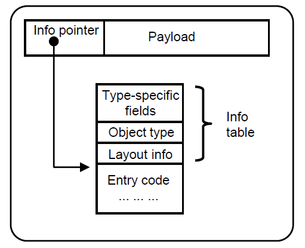

# Haskell 

## {.column width="30%"}


## {.column width="50%"}

- Search for a "common functional language"
- 1987-1989 commitee meetings
- 1989 start of development, 1990 Haskell version 1.0
- Named after mathematician Haskell Curry

*A history of Haskell: being lazy with class* [@hudak2007history]

# GHC

- Glasgow Haskell Compiler
- Written in Haskell
- Lead Developers: 
  - Simon Peyton Jones (Microsoft Research)
  - Simon Marlow (Facebook)
- De facto default Haskell compiler
- [https://gitlab.haskell.org/ghc/ghc/wikis/index](https://gitlab.haskell.org/ghc/ghc/wikis/index)

# GHC Compilation Flow

```{.haskell style="font-size: large"}

                                                                          +---------+
                                                         LLVM backend /-->| LLVM IR |-\
                                                                      |   +---------+ | LLVM
                                                                      |               v
 +------------+ Desugar  +------+ STGify  +-----+ CodeGen  +-----+    |  NCG    +----------+
 | Parse tree |--------->| Core |-------->| STG |--------->| C-- |----+-------->| Assembly |
 +------------+          +------+         +-----+          +-----+    |         +----------+
                                                                      |            ^
                                                                      |     +---+  | GCC
                                                            C backend \---->| C |--/
                                                                            +---+

```

[https://gitlab.haskell.org/ghc/ghc/wikis/commentary/compiler/generated-code](https://gitlab.haskell.org/ghc/ghc/wikis/commentary/compiler/generated-code){.small}

# {.notes}

1. Type Checking, parse tree
2. intermediate Core language
3. STG language
4. C - - 
5. Assembly through NCG (default), LLVM or C


# The Spineless Tagless G-Machine

Compiled graph reduction machine for a lazy functional language

@jones1992implementing:
: *Implementing lazy functional languages on stock hardware: the Spineless Tagless G-machine*

@marlow2004making:
: *Making a fast curry: push/enter vs. eval/apply for higher-order languages*

@marlow2007faster:
: *Faster Laziness Using Dynamic Pointer Tagging*
 
# Other examples/Predecessors

- G-machine [@johnsson1984efficient]
- TIM: Three Instruction Machine [@fairbairn1987tim]

# {.notes}

- TIM was for a language called "Ponder"

#

## Spineless

- STG program is a graph, not a tree
- Graph not represented as single data structure in memory 
- Small, individual parts of the graph that reference each other

#

## Tagless

{width=75%}


#

Tagless
: Refers to how a heap closure is evaluated
: `f x y = case x of (a,b) -> a+y`
: Before taking x apart: STGM pushes code to stack and jumps to entry code for x

TagFUL
: Closure to evaluate is only entered if its tag says it is unevaluated

# Update 2007

*Faster Laziness Using Dynamic Pointer Tagging* [@marlow2007faster]

- Tagless scheme more expensive (additional indirect jumps)
- *Dynamic pointer tagging*:  using spare low bits of a pointer to encode information about pointed-to closure

# Heap object structure



Here: every heap object has associated entry code. Therefore term "closure" is used for any heap object

# 

Closure
: Block of static code together with values of its free variables. Physical representation of such a closure is a pointer to a contiguous block of
heap-allocated storage

Thunk
: Suspended computation. In a non-strict language, values are passed in unevaluated form, and only evaluated when their value is actually required. These unevaluated forms capture a suspended computation and can be represented by a closure in the same way as a function value. When a thunk is forced for the first time, it is physically updated with its value

[@jones1992implementing]


# Saturated Calls

```{.haskell}
f :: Int -> Int -> Int
f x y = x*y
```
## 
- `(f 3 4)` is a call to a **known function** (saturated call)
- Compiler simply loads arguments and calls code for `f` directly
- What happens with "unknown" functions?

# Example

```{.haskell style="font-size: x-large"}
zipWith :: (a -> b -> c) -> [a] -> [b] -> [c]
zipWith k [] [] = []
zipWith k (x:xs) (y:ys) = k x y : zipWith k xs ys
```
## 
- k is an **unknown function** 
  - Might take one argument, compute for a while and return function that consumes next argument
  - Might take three arguments, so that result of `zipWith` is list of functions


# Push/Enter vs Eval/Apply


## 
Push/Enter
: The function which statically knows its own arity examines the stack to figure out how many arguments it has been passed and where they are.

## 
Eval/Apply
: The caller which statically knows what the arguments are examines the function closure, extracts its arity and makes an exact call to the function.

[@marlow2004making]


# The STG Language (Syntax)

## Expressions
```{.haskell style="font-size: large"}
e ::= a
    | f a1 ... an                   (function call (n >= 1))
    ...
    | let x = obj in e    
    | case e of {alt1; ...; altn}   (n >= 1)
```

## Heap objects
```{.haskell style="font-size: large"}
obj ::= FUN(x1 ... xn -> e)   (Function: arity = n >=1
      | PAP(f a1 ... an)      (Partial application: 
                              f is always a FUN with arity(f) > n >= 1)
      | CON(C a1 ... an)      (Saturated constructor n >= 0)
      | THUNK e
      | BLACKHOLE             (only during evaluation)
```

# {.notes}

- let expression allocates object in the heap
- $FUN(x_1 ... x_n -> e)$
  - function closure with arguments $x_i$ and body $e$
  - function is curried (may be applied to less than n or more than n arguments) but still has arity of n
- $PAP(f~a_1 ... a_n)$
  - Partial application of f to arguments a1...an; f is guaranteed to be FUN object, arity of FUN is guaranteed to be >n
- $CON(C~a_1 ... a_n)$: data value; saturated application of constructor C to arguments
- $THUNK~e$: a thunk, or suspension. When its value is needed, e is evalu-
ated, and the thunk overwritten with (an indire
tion to) the value of e
- $BLACKHOLE$: used only during evaluation of thunk; replaces thunk to avoid space leaks

# Example: map

## Haskell
```{.haskell style="font-size: large"}
map f [] = []
map f (x:xs) = f x : map f xs
```

## STG
```{.haskell style="font-size: large"}
nil = CON Nil

map = FUN (f xs ->
        case xs of
          Nil -> nil
          Cons y ys -> let h = THUNK (f y)
                           t = THUNK (map f ys)
                           r = CON (Cons h t)
                        in r
     )
```


# Ministg

- [https://github.com/bjpop/ministg](https://github.com/bjpop/ministg)
- STG interpreter written in Haskell
- Provides insight in STG language evaluation
- Optional tracing of program execution

## "Alternative" to ministg
- stgi
- [https://github.com/quchen/stgi](https://github.com/quchen/stgi)
- Also STG interpreter but based on [@jones1992implementing]

# Example 

## Program: apply.stg
```haskell
const = FUN(x y -> x);
apply = FUN(f x -> f x);

twentytwo = CON(I 22);
main = THUNK(apply const true twentytwo)
```
## Output
```haskell
true
```

# Eval/Apply Trace

Expression
: Code that is under evaluation

Stack
: Stack of continuations. What to do when current expression is evaluated

Heap
: Finite mapping from variables to heap objects


[:include](include/ea_trace.md)


# Push/Enter Trace

[html](trace/trace_pe/step0.html){target="_blank" .resource}

[](trace/trace_pe/step1.html){.resource}
[](trace/trace_pe/step2.html){.resource}
[](trace/trace_pe/step3.html){.resource}
[](trace/trace_pe/step4.html){.resource}
[](trace/trace_pe/step5.html){.resource}
[](trace/trace_pe/step6.html){.resource}
[](trace/trace_pe/step7.html){.resource}

# {.notes}

- First step more or less the same, main is a thunk that gets replaced with a BH during eval
- all arguments to apply get pushed on stack
- FENTER: (eintritt in die argumente zu apply)
- PUSH: alle argumente an const werden auf den stack gepusht
- FENTER: in const, const nimmt exakt zwei argumente und exakt soviele sind im stack
- true bleibt zurück
- Update: main blackhole wird mit wert upgedated

<!--
# Comparison

## Pro Eval/Apply

- When calling unknown function with right number of arguments, arguments can be passed in registers rather than on stack. For registerrich architecture strongest reason for e/a. p/e forces arguments to unknown functions to be passed on the stack
- Easier to map to portable assembly language such as C or C - -
- No need to distinguish return addresses from heap pointers. ("This is a big win" [@marlow2004making])
- No tagging for non-pointers

#

## Pro Push/Enter

- Appears to be natural fit with currying
- Eliminates some PAP allocations compared to e/a
- payload of PAP object can be self-describing because arguments are tagged. In contrast, an e/a PAP object relies on its FUN to describe the layout of he payload. this results in some extra complication in the garbage collector and an extra global invariant: a PAP must contain a FUN. cannot contain another PAP

-->

# Conclusion

- It is impossible to a rational conclusion about performance based on just the differences between the models
- Push/Enter seems to be natural fit with currying
- Eval/Apply seems to have decisive advantages in terms of complexity
- Easier to map code to portable assembly language with E/A
- Bottom Line: If Eval/Apply is no more expensive than push/enter it is definitely to be preferred
- Performance measuring shows: Eval/Apply is better

[@marlow2004making]


#

